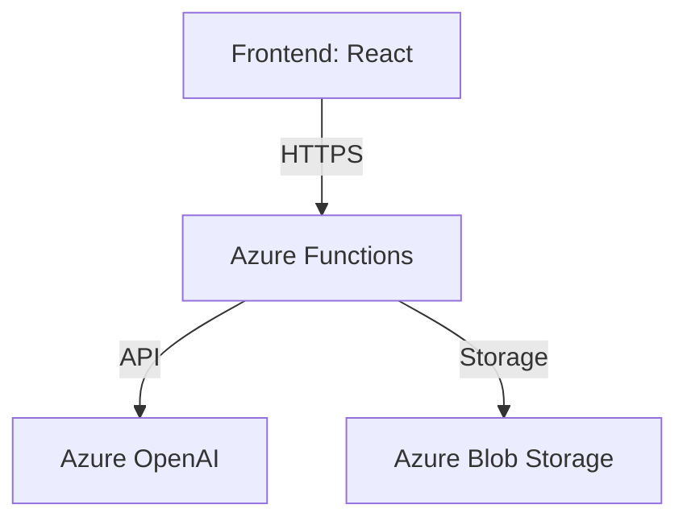

# 🚀 Vexa - Agente de IA Conversacional 

  

Vexa es un agente de IA conversacional avanzado que utiliza Azure OpenAI para proporcionar respuestas inteligentes y contextuales, con capacidad de mantener historial de conversaciones.

## 🌟 Características Principales

- 💬 Chat interactivo con modelo GPT-4
- 📚 Historial de conversaciones persistente
- 🎨 Interfaz moderna tipo ChatGPT
- 🔄 Sincronización en tiempo real
- 🔐 Autenticación básica por usuario

## 🛠️ Arquitectura



## 📋 Prerrequisitos Locales

- **Node.js v16+** - [Descargar](https://nodejs.org/)
- **Azure CLI** - [Instalar](https://docs.microsoft.com/es-es/cli/azure/install-azure-cli)
- **Azure Functions Core Tools**:

```bash
npm install -g azure-functions-core-tools@4
```

## 🔧 Configuración de Azure

### 1. Creación de Recursos

**Azure Functions:**
- Runtime: Node.js 16+
- Plan: Consumption (sin servidor)

**Static Web App:**
- Framework: React
- Ubicación API: `/api`

**Azure OpenAI Service:**
- Implementar modelo GPT-4
- Anotar clave y endpoint

**Blob Storage:**
- Crear contenedor `chat-history`

### 2. Configuración de Variables

**En cada servicio, configurar:**

**Functions:**
```text
AZURE_OPENAI_ENDPOINT=<tu-endpoint>
AZURE_OPENAI_KEY=<tu-clave>
AZURE_OPENAI_DEPLOYMENT=<nombre-deployment>
AZURE_STORAGE_CONNECTION_STRING=<cadena-conexión>
```

**Static Web App:**
```text
REACT_APP_API_URL=https://<nombre-functions>.azurewebsites.net/api
```

## 🚀 Implementación

### Backend (Azure Functions)

```bash
cd backend
npm install
az login
func azure functionapp publish <nombre-functions>
```

### Frontend (Static Web App)

```bash
cd frontend
npm install
npm run build
az staticwebapp upload --name <nombre-webapp> --source-path build
```

## 🖥️ Ejecución Local

**Backend:**
```bash
cd backend
npm start
```

**Frontend:**
```bash
cd frontend
npm start
```

Configurar `.env` local con:
```text
REACT_APP_API_URL=http://localhost:7071/api
```

## 🔒 Configuración de Seguridad

### CORS

En Functions, permitir solo:
- URL de producción
- `http://localhost:3000`

### Key Vault (recomendado)

```bash
az keyvault create --name <nombre-keyvault> --resource-group <grupo-recursos>
az keyvault secret set --vault-name <nombre-keyvault> --name OpenAIKey --value <tu-clave>
```

## 📈 Monitoreo

Configurar Application Insights:

```bash
az monitor app-insights component create --app vexa-insights --resource-group <grupo-recursos>
```

## 🤝 Contribución

1. Haz fork del proyecto
2. Crea tu rama (`git checkout -b feature/fooBar`)
3. Haz commit de tus cambios (`git commit -am 'Add some fooBar'`)
4. Haz push a la rama (`git push origin feature/fooBar`)
5. Crea un nuevo Pull Request


---

Hecho con dedicación por Ariel Murillo | [Documentación Azure](https://docs.microsoft.com/es-es/azure/)
